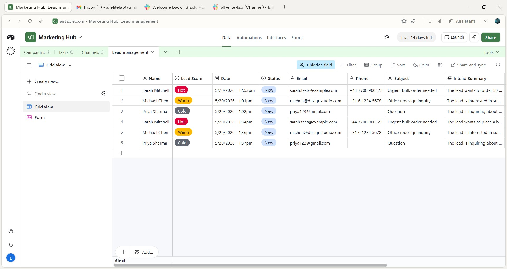

# BrightCart — AI Lead Qualification Bot

A Make.com scenario that automatically scores inbound leads with AI, logs every one to Airtable, and alerts the team in Slack only when a lead is worth an immediate response.

Built as a demo project using a fictional e-commerce brand ("BrightCart") to showcase a lead qualification pattern I've used in real client automation work.

## What it does

1. A lead submits a contact/inquiry form → hits a webhook
2. OpenAI reads the lead's message and returns a qualification score (0-100), a category (Hot / Warm / Cold), and a suggested next action
3. Every lead, regardless of score, gets logged to Airtable, nothing falls through the cracks
4. A Router splits the flow: only **Hot** leads trigger an immediate Slack alert to the team

This means the sales team's Slack channel only pings for leads actually worth dropping what they're doing for, while every single lead still has a permanent record.


*The full scenario: Webhook → OpenAI → JSON Parse → Airtable → Router → Slack*
## How it looks in practice

**A lead comes in through the form:**


**OpenAI scores it and drafts a next action:**


**The response gets parsed into structured fields:**


**Every lead lands in Airtable, hot or not:**



## Why this pattern

Manually triaging inbound leads doesn't scale, someone ends up either reading every single submission (slow, doesn't scale) or skimming and missing good leads in the noise. This scenario automates the *triage* step specifically, not the sales conversation, that part stays human. It just makes sure the right leads reach a human fast.

See [architecture.md](./architecture.md) for the full breakdown of why each module is built the way it is, including a few decisions that look simple but avoid real failure modes (like why Airtable logging happens *before* the Router filters anything).

## Stack

- **Make.com** — orchestration
- **OpenAI (GPT)** — lead scoring and qualification
- **Airtable** — system of record for every lead
- **Slack** — real-time alerting for hot leads only

## Repo contents

```
├── README.md                              you are here
├── architecture.md                        design decisions and reasoning
├── scenario-export/
│   └── brightcart-lead-qualifier.json     full module-by-module breakdown
└── docs/
    └── screenshots/                       scenario view, sample outputs
```

## Status

This is a working demo pattern, not a finished product. One Router path (for Warm/Cold leads) is intentionally left unbuilt in this version, documented in [architecture.md](./architecture.md) as an extension point rather than filled with a placeholder. A production deployment for a real client would typically build that path out based on how that specific business wants to follow up on warm leads.

## About this project

Built to demonstrate hands-on Make.com + AI automation experience: webhook-triggered flows, structuring AI output for downstream use, conditional routing, and multi-tool integration (Airtable + Slack). Reach out if you're looking for something similar built around your actual CRM and lead flow.
